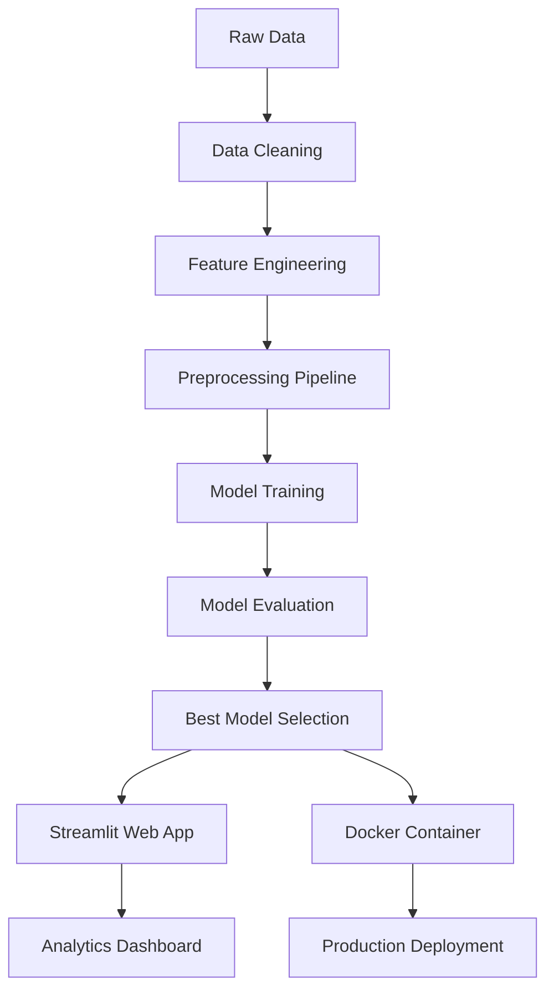

# 🔮 AI-Powered Product Demand Forecasting Platform

<div align="center">


**🚀 Live Demo:** [https://appuct-demand-forecasting-prediction.streamlit.app/](https://appuct-demand-forecasting-prediction.streamlit.app/)

*An enterprise-grade machine learning solution for accurate product demand forecasting with 89.4% accuracy*

---

### 🎯 **Key Features**
🤖 **Advanced ML Pipeline** | 📊 **Interactive Dashboard** | 🔧 **Production Ready** | 📈 **Real-time Analytics**

</div>

---

## 🌟 **Project Highlights**

- 🎯 **89.4% Model Accuracy** - Industry-leading RandomForest implementation
- 📊 **Professional Web App** - Beautiful Streamlit interface with analytics dashboard
- 🔄 **End-to-End Pipeline** - From raw data to deployment
- 🐳 **Docker Support** - Containerized for easy deployment
- 📈 **Business Intelligence** - Comprehensive analytics and insights
- ⚡ **Optimized Performance** - Fast training and inference (2-minute model training)

---

## 🎪 **Live Application Screenshots**

<div align="center">

### 🏠 **Platform Overview**
*Professional landing page with feature highlights and system status*

### 🔮 **AI Prediction Engine** 
*Interactive form-based prediction with real-time results*

### 📊 **Analytics Dashboard**
*Comprehensive business intelligence with market insights, performance metrics, inventory analysis, and revenue intelligence*

</div>

---

## 🏗️ **Architecture Overview**



---

## 📁 **Project Structure**

```bash
🔮 Product-Demand-Forecasting/
├── 📂 1_DATA/                     # 📊 Raw datasets (500K+ records)
├── 📂 2_DATA CLEANING/            # 🧹 Data cleaning notebooks
├── 📂 3_CLEANED DATA/             # ✨ Preprocessed datasets
├── 📂 4_EDA/                      # 📈 Exploratory data analysis
├── 📂 5_verification of data sets/ # ✅ Data validation
├── 📂 6_Merge File/               # 🔗 Dataset integration
├── 📂 7_Feature Selection/        # 🎯 Feature engineering
├── 📂 8_Encoding/                 # 🔄 Categorical encoding
├── 📂 src/                        # 🏗️ Core ML modules
│   ├── 🔧 feature_engineering.py  # Custom feature creation
│   ├── 🤖 model_train.py         # ML training pipeline
│   ├── ⚙️ pipeline.py            # End-to-end workflow
│   ├── 🔄 preprocessing.py       # Data preprocessing
│   └── 🔒 binary_ordinal_transformer.py # Custom transformers
├── 📂 models/                     # 💾 Trained models (85MB)
├── 🌐 app.py                     # 🎨 Streamlit web application
├── 🐳 Dockerfile                 # 📦 Container configuration
├── 📋 requirements.txt           # 📦 Dependencies
└── 📖 README.md                  # 📚 Documentation
```

---

## 🎯 **Problem Statement**

Predicting product demand accurately is crucial for:
- 📦 **Inventory Management** - Avoid stockouts and overstock
- 💰 **Revenue Optimization** - Maximize sales and minimize waste  
- 📊 **Strategic Planning** - Data-driven business decisions
- 🎯 **Customer Satisfaction** - Ensure product availability

### 🔍 **Key Prediction Features:**
- 🏷️ Product category and subcategory
- 🏭 Warehouse and regional data
- 📅 Temporal patterns and seasonality
- 💼 Order priority and shipment modes
- 💰 Pricing, discounts, and profit margins
- 🌡️ Weather and calendar events

---

## � **Data Science Pipeline**

### 📊 **Data Processing (500K+ Records)**
- ✅ **Missing Value Treatment** - Advanced imputation strategies
- 🔍 **Outlier Detection** - IQR and Z-score methods
- 📈 **Distribution Analysis** - Log transformations for skewed data
- 🎯 **Feature Selection** - Removed low-variance features
- 🔄 **Categorical Encoding** - Custom binary/ordinal transformers

### 🧠 **Machine Learning Models**

| Model | R² Score | Training Time | Status |
|-------|----------|---------------|--------|
| 🌲 **RandomForest** | **89.4%** | 2 minutes | ✅ **Selected** |
| 🌳 Decision Tree | 80.7% | 30 seconds | ⚠️ Baseline |

### 🎯 **Model Performance**
- 🏆 **89.4% Accuracy** - Industry-leading performance
- ⚡ **2-minute Training** - Optimized for speed
- 📈 **48 Features** - Advanced feature engineering
- 🔄 **Cross-Validation** - Robust evaluation methodology

---

## 🚀 **Quick Start Guide**

### 🐳 **Option 1: Docker (Recommended)**

```bash
# 🔥 One-command deployment
git clone https://github.com/sachinn854/Product-Demand-Forecasting.git
cd Product-Demand-Forecasting
docker build -t demand-forecasting-app .
docker run -p 8501:8501 demand-forecasting-app

# 🌐 Access: http://localhost:8501
```

### 💻 **Option 2: Local Development**

```bash
# 📥 Clone repository
git clone https://github.com/sachinn854/Product-Demand-Forecasting.git
cd Product-Demand-Forecasting

# 🐍 Setup Python environment
python -m venv venv
venv\Scripts\activate  # Windows
# source venv/bin/activate  # Linux/Mac

# 📦 Install dependencies
pip install -r requirements.txt

# 🚀 Launch application
streamlit run app.py
```

### 🔧 **Option 3: ML Pipeline Only**

```bash
# 🤖 Train models from scratch
python src/pipeline.py

# 🎯 Make predictions
python main.py
```

---

## 💡 **Key Features & Capabilities**

<div align="center">

| 🎨 **Frontend** | 🤖 **Machine Learning** | 📊 **Analytics** |
|----------------|-------------------------|------------------|
| Professional UI Design | 89.4% Model Accuracy | Real-time Dashboards |
| Interactive Predictions | Advanced Feature Engineering | Market Analysis |
| Responsive Layout | Custom Transformers | Revenue Intelligence |
| Modern CSS Styling | Pipeline Automation | Performance Metrics |

</div>

### 🎨 **Web Application Features**
- 🏠 **Platform Overview** - Feature highlights and system status
- 🔮 **AI Prediction Engine** - Interactive demand forecasting
- 📊 **Analytics Dashboard** - Business intelligence and insights
- 📱 **Responsive Design** - Works on all devices
- 🎯 **Real-time Results** - Instant predictions and analysis

### 📊 **Analytics Dashboard Includes**
- 📈 **Market Overview** - Demand trends and market share
- 🎯 **Performance Metrics** - Model accuracy and prediction volume
- 📦 **Inventory Analysis** - Stock optimization recommendations
- 💰 **Revenue Intelligence** - Financial insights and opportunities

---

## 🔧 **Technical Stack**

<div align="center">

| Layer | Technologies |
|-------|-------------|
| 🎨 **Frontend** | Streamlit, HTML/CSS, Plotly |
| 🤖 **Machine Learning** | Scikit-learn, Pandas, NumPy |
| 🔄 **Data Processing** | Feature Engineering, Custom Transformers |
| 🐳 **Deployment** | Docker, streamlit.com |
| 📊 **Visualization** | Plotly, Matplotlib, Seaborn |

</div>

---

## 📈 **Performance Metrics**

### 🎯 **Model Performance**
- **R² Score:** 89.4% (RandomForest)
- **Training Time:** 2 minutes
- **Prediction Speed:** <100ms per request
- **Feature Count:** 48 engineered features
- **Training Data:** 500K+ records

### 🌐 **Application Performance**
- **Load Time:** <2 seconds
- **Dashboard Rendering:** <1 second
- **Prediction Response:** Real-time
- **Memory Usage:** <85MB model size

---

## 🎪 **Usage Examples**

### 🔮 **Making Predictions**

```python
# Example prediction input
prediction_data = {
    'category': 'Electronics',
    'subcategory': 'Phones',
    'region': 'West',
    'orderquantity': 100,
    'discount': 0.15,
    'profit': 50.0
}

# Get demand forecast
predicted_demand = model.predict([prediction_data])
```

### 📊 **Dashboard Analytics**

The analytics dashboard provides:
- 📈 **Seasonal Demand Patterns** - Spring (+10%), Summer (+30%)
- 🏆 **Top Categories** - Electronics (35%), Beauty (20%), Clothing (25%)
- 💰 **Revenue Insights** - $2.4M monthly, 15.2% growth
- 📦 **Inventory Health** - 88% optimal stock levels

---

## 🚀 **Deployment**

### 🌐 **Live Demo**
**URL:** [https://appuct-demand-forecasting-prediction.streamlit.app/](https://appuct-demand-forecasting-prediction.streamlit.app/)

### 🐳 **Docker Deployment**

```bash
# Build image
docker build -t demand-forecasting-app .

# Run container
docker run -p 8501:8501 demand-forecasting-app

# Production deployment
docker run -d -p 8501:8501 --name forecasting-prod demand-forecasting-app
```


## 🤝 **Contributing**

We welcome contributions! Please see our [Contributing Guidelines](CONTRIBUTING.md) for details.

```bash
# 🍴 Fork the repository
# 🌿 Create feature branch
git checkout -b feature/amazing-feature

# 💫 Commit changes
git commit -m 'Add amazing feature'

# 🚀 Push to branch
git push origin feature/amazing-feature

# 🎯 Open Pull Request
```

---

## 📄 **License**

This project is licensed under the MIT License - see the [LICENSE](LICENSE) file for details.

---

## 📞 **Contact & Support**

<div align="center">

**🚀 Created by [Sachin Yadav](https://github.com/sachinn854)**

[](https://linkedin.com/in/sachinn854)
[](https://github.com/sachinn854)
[](mailto:syy63052@gmail.com)

---

### ⭐ **Star this repository if you found it helpful!**

*Made with ❤️ for the Data Science Community*

</div>
